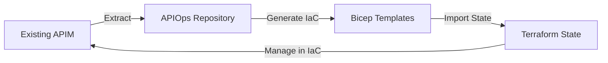

# Legacy APIM Migration Guide

*Migration strategy for existing Azure API Management instances to APIOps methodology*

---

## Overview

Many enterprises have existing APIM instances created through:
- **Azure Portal** (manual configuration)
- **Azure PowerShell/CLI** (imperative scripts)
- **ARM Templates** (non-parameterized or one-off deployments)
- **Legacy CI/CD** (without GitOps principles)

This guide provides a structured approach to migrate existing APIM instances to modern APIOps practices while maintaining business continuity.

---

## Migration Assessment Framework

### Phase 1: Current State Analysis

#### 1.1 Extract Existing Configuration
```bash
# Use APIOps extractor to capture current state
./extractor -s <subscription-id> -g <resource-group> -n <apim-name>

# This creates a complete snapshot of:
# - All APIs and their configurations
# - Policies (global and API-specific)
# - Products and subscriptions
# - Groups and users
# - Named values and secrets
# - Diagnostics and logging
```

#### 1.2 Assess Infrastructure Maturity
| Aspect | Manual Portal | Scripted | IaC Ready | Migration Complexity |
|--------|---------------|----------|-----------|---------------------|
| **APIM Service** | ❌ Portal-created | ⚠️ Script-based | ✅ Bicep/Terraform | **HIGH** → **LOW** |
| **Network Config** | ❌ Manual VNet | ⚠️ CLI commands | ✅ Template-defined | **HIGH** → **LOW** |
| **DNS/Certificates** | ❌ Portal upload | ⚠️ PowerShell | ✅ Key Vault linked | **MEDIUM** → **LOW** |
| **Monitoring** | ❌ Manual setup | ⚠️ Script config | ✅ Template-based | **LOW** → **LOW** |

#### 1.3 Identify Migration Blockers
**Common Challenges:**
- **Custom Domains**: Hard-coded certificates vs Key Vault integration
- **Named Values**: Plaintext secrets vs Key Vault references  
- **Network Dependencies**: Manual VNet peering vs template-defined
- **Access Patterns**: Manual user assignments vs group-based RBAC

---

## Migration Strategies

### Strategy A: Parallel Environment (Recommended)

**Best For**: Production environments where downtime is not acceptable


**Implementation Steps:**

1. **Extract Configuration**
   ```bash
   # Extract all artifacts from existing APIM
   ./extractor -s prod-subscription -g rg-apim-prod -n apim-legacy-prod
   ```

2. **Create IaC Templates**
   ```bicep
   // main.bicep - New APIM with identical configuration
   param apimName string = 'apim-new-prod'
   param vnetConfig object = {
     // Match existing network configuration
   }
   ```

3. **Deploy Parallel Instance**
   ```bash
   # Deploy new APIM alongside existing
   az deployment group create --resource-group rg-apim-new-prod --template-file main.bicep
   ```

4. **Migrate Traffic Gradually**
   - Start with non-critical APIs
   - Use Azure Traffic Manager for gradual migration
   - Monitor performance and error rates

**Timeline**: 4-6 weeks
**Risk**: LOW (existing system remains untouched)
**Cost**: MEDIUM (dual APIM instances temporarily)

### Strategy B: In-Place IaC Adoption

**Best For**: Development/staging environments or when cost is a constraint



**Implementation Steps:**

1. **Extract and Template**
   ```bash
   # Extract current configuration
   ./extractor -s dev-subscription -g rg-apim-dev -n apim-legacy-dev
   
   # Generate equivalent Bicep
   az apim show --name apim-legacy-dev --resource-group rg-apim-dev --output table
   ```

2. **Import Existing Resources**
   ```bash
   # For Terraform (if using Terraform)
   terraform import azurerm_api_management.main /subscriptions/{id}/resourceGroups/{rg}/providers/Microsoft.ApiManagement/service/{name}
   
   # For Bicep/ARM - use what-if to verify
   az deployment group what-if --resource-group rg-apim-dev --template-file main.bicep
   ```

3. **Incremental Management**
   - Start managing APIs and policies via APIOps
   - Gradually move networking and infrastructure to IaC
   - Maintain backward compatibility during transition

**Timeline**: 2-3 weeks  
**Risk**: MEDIUM (changes to live system)
**Cost**: LOW (no additional resources)

### Strategy C: Greenfield Migration

**Best For**: Major architecture changes or legacy system replacement

- Complete redesign with modern architecture
- New subscription/resource group
- Migration of business logic only
- Fresh start with APIOps from day one

**Timeline**: 8-12 weeks
**Risk**: HIGH (complete rebuild)
**Cost**: MEDIUM to HIGH

---

## Migration Checklist

### Pre-Migration
- [ ] **Audit current APIM configuration** using extractor
- [ ] **Document all external dependencies** (backends, certificates, custom domains)
- [ ] **Identify sensitive configurations** (named values, connection strings)
- [ ] **Map network topology** (VNets, subnets, NSGs, peering)
- [ ] **Review access patterns** (users, groups, applications)
- [ ] **Assess API usage patterns** (traffic, performance requirements)

### During Migration
- [ ] **Set up APIOps repository** with extracted artifacts
- [ ] **Create parameterized IaC templates** (Bicep or Terraform)
- [ ] **Implement CI/CD pipeline** with proper validation gates
- [ ] **Configure Key Vault integration** for secrets management
- [ ] **Set up monitoring and alerting** (Application Insights, Azure Monitor)
- [ ] **Test API functionality** in new environment

### Post-Migration
- [ ] **Validate all APIs** are functioning correctly
- [ ] **Update DNS records** to point to new APIM
- [ ] **Monitor performance** and error rates
- [ ] **Train operations team** on new APIOps workflows
- [ ] **Document new architecture** and operational procedures
- [ ] **Decommission legacy resources** (if applicable)

---

## Common Migration Patterns

### Named Values Migration
```bash
# Before: Plaintext secrets in portal
ai-toolkit-key: "actual-secret-value"

# After: Key Vault references
ai-toolkit-key: "@Microsoft.KeyVault(VaultName=apim-kv;SecretName=ai-toolkit-key)"
```

### Policy Migration
```xml
<!-- Before: Hard-coded values -->
<set-header name="Authorization" exists-action="override">
  <value>Bearer actual-token-here</value>
</set-header>

<!-- After: Named value references -->
<set-header name="Authorization" exists-action="override">
  <value>Bearer {{ai-toolkit-key}}</value>
</set-header>
```

### Network Configuration
```bicep
// Before: Manual VNet configuration
// Portal: Networking > Virtual Network > Connect

// After: Template-defined
resource vnetIntegration 'Microsoft.ApiManagement/service@2023-05-01-preview' = {
  name: apimName
  properties: {
    virtualNetworkType: 'Internal'
    virtualNetworkConfiguration: {
      subnetResourceId: apimSubnet.id
    }
  }
}
```

---

## Risk Mitigation Strategies

### Business Continuity
1. **Blue-Green Deployment**: Maintain parallel environments during migration
2. **Gradual Traffic Migration**: Use Azure Front Door or Traffic Manager
3. **Rollback Planning**: Document rollback procedures for each phase
4. **Comprehensive Testing**: Validate APIs in staging before production

### Security Considerations
1. **Secret Rotation**: Migrate secrets to Key Vault before cutover
2. **Access Control**: Implement proper RBAC during migration
3. **Network Security**: Ensure NSGs and firewall rules are properly configured
4. **Compliance**: Validate that new architecture meets security requirements

### Performance Optimization
1. **Capacity Planning**: Right-size new APIM instance based on usage patterns
2. **Caching Strategy**: Implement appropriate caching policies
3. **Load Testing**: Validate performance under expected load
4. **Monitoring**: Set up comprehensive monitoring and alerting

---

## Success Criteria

### Technical
- [ ] All APIs migrated and functional
- [ ] Infrastructure managed via IaC
- [ ] CI/CD pipeline operational
- [ ] Security controls implemented
- [ ] Monitoring and alerting active

### Operational
- [ ] Team trained on APIOps workflows
- [ ] Documentation updated
- [ ] Runbooks created
- [ ] Support processes defined
- [ ] Change management procedures in place

### Business
- [ ] No service disruption during migration
- [ ] Performance maintained or improved
- [ ] Security posture enhanced
- [ ] Operational efficiency increased
- [ ] Cost optimization achieved

---

## Troubleshooting Common Issues

### Named Values Not Working
```bash
# Issue: Named values not resolving in policies
# Solution: Verify Key Vault access policy
az keyvault set-policy --name <vault-name> --object-id <apim-managed-identity> --secret-permissions get list
```

### Network Connectivity Issues
```bash
# Issue: Backend services not reachable
# Solution: Check NSG rules and route tables
az network nsg rule list --resource-group <rg> --nsg-name <nsg-name>
```

### Certificate Problems
```bash
# Issue: SSL certificate not working
# Solution: Verify certificate in Key Vault and APIM access
az keyvault certificate show --vault-name <vault> --name <cert-name>
```

---

## References

- [APIOps Documentation](https://azure.github.io/apiops/)
- [APIM Migration Best Practices](https://docs.microsoft.com/azure/api-management/api-management-migrate)
- [Azure Key Vault Integration](https://docs.microsoft.com/azure/api-management/api-management-howto-properties)
- [APIM Networking Guide](https://docs.microsoft.com/azure/api-management/api-management-using-with-vnet)

---

*Legacy APIM Migration Guide - Supporting enterprises in adopting modern APIOps practices*
