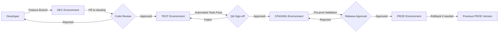

# APIM Landing Zone Accelerator - Environment Promotion Strategy

*Multi-environment CI/CD strategy for Devon Energy's API Management platform*

> 🚀 **Evolution from Sandbox**  
> This document outlines the progression from the current sandbox implementation (single environment) to a production-ready multi-environment CI/CD pipeline with proper governance, approval gates, and rollback capabilities.

---

## Current State vs Target State

### 📊 **Current Sandbox Implementation**
```
┌─────────────────┐
│   Sandbox       │
│   (import)      │ ──► Single Environment
│                 │     Direct Deployment
└─────────────────┘
```

### 🎯 **Target Multi-Environment Pipeline**
```
┌─────────┐    ┌─────────┐    ┌─────────┐    ┌─────────┐
│   DEV   │───▶│  TEST   │───▶│ STAGING │───▶│  PROD   │
│ feature │    │ develop │    │ release │    │  main   │
│ branches│    │ branch  │    │ branch  │    │ branch  │
└─────────┘    └─────────┘    └─────────┘    └─────────┘
     │              │              │              │
     ▼              ▼              ▼              ▼
┌─────────┐    ┌─────────┐    ┌─────────┐    ┌─────────┐
│ devon-  │    │ devon-  │    │ devon-  │    │ devon-  │
│ dev     │    │ test    │    │ staging │    │ prod    │
│ APIM    │    │ APIM    │    │ APIM     │    │ APIM    │
└─────────┘    └─────────┘    └─────────┘    └─────────┘
```

---

## Environment Promotion Flow

### 🔄 **Stage-Gate Promotion Model**



### 📋 **Environment Characteristics**

| Environment | Purpose | Trigger | Approval Required | Monitoring Level |
|-------------|---------|---------|-------------------|------------------|
| **DEV** | Feature development, rapid iteration | Feature branch push | None | Basic |
| **TEST** | Integration testing, API validation | PR to develop branch | Code review | Standard |
| **STAGING** | Pre-production validation, performance testing | PR to release branch | QA sign-off | Enhanced |
| **PROD** | Live customer traffic | PR to main branch | Release approval | Full observability |

---

## GitHub Actions Multi-Environment Pattern

### 🔧 **Workflow Structure**

```yaml
# .github/workflows/apim-multi-env.yml
name: APIM Multi-Environment Deployment

on:
  push:
    branches: [develop, release, main]
  pull_request:
    branches: [develop, release, main]

jobs:
  determine-environment:
    runs-on: ubuntu-latest
    outputs:
      environment: ${{ steps.env.outputs.environment }}
      deploy: ${{ steps.env.outputs.deploy }}
    steps:
      - name: Determine Environment
        id: env
        run: |
          if [[ "${{ github.ref }}" == "refs/heads/main" ]]; then
            echo "environment=prod" >> $GITHUB_OUTPUT
            echo "deploy=true" >> $GITHUB_OUTPUT
          elif [[ "${{ github.ref }}" == "refs/heads/release" ]]; then
            echo "environment=staging" >> $GITHUB_OUTPUT
            echo "deploy=true" >> $GITHUB_OUTPUT
          elif [[ "${{ github.ref }}" == "refs/heads/develop" ]]; then
            echo "environment=test" >> $GITHUB_OUTPUT
            echo "deploy=true" >> $GITHUB_OUTPUT
          elif [[ "${{ github.base_ref }}" == "develop" ]]; then
            echo "environment=dev" >> $GITHUB_OUTPUT
            echo "deploy=false" >> $GITHUB_OUTPUT
          else
            echo "environment=dev" >> $GITHUB_OUTPUT
            echo "deploy=false" >> $GITHUB_OUTPUT
          fi

  validate:
    runs-on: ubuntu-latest
    steps:
      - uses: actions/checkout@v4
      - name: Validate OpenAPI Specs
        run: |
          # Spectral linting for all environments
          npx @stoplight/spectral-cli lint "artifacts/apis/**/*.yaml"
      
      - name: Validate Parameter Files
        run: |
          # Ensure environment-specific parameters exist
          if [ ! -f "infra/params/devon-${{ needs.determine-environment.outputs.environment }}.json" ]; then
            echo "Missing parameter file for ${{ needs.determine-environment.outputs.environment }}"
            exit 1
          fi

  deploy:
    needs: [determine-environment, validate]
    if: needs.determine-environment.outputs.deploy == 'true'
    runs-on: ubuntu-latest
    environment: ${{ needs.determine-environment.outputs.environment }}
    steps:
      - uses: actions/checkout@v4
      
      - name: Azure Login (OIDC)
        uses: azure/login@v1
        with:
          client-id: ${{ secrets.AZURE_CLIENT_ID }}
          tenant-id: ${{ secrets.AZURE_TENANT_ID }}
          subscription-id: ${{ vars[format('AZURE_SUBSCRIPTION_ID_{0}', upper(needs.determine-environment.outputs.environment))] }}

      - name: Deploy to APIM
        run: |
          # Environment-specific deployment
          ./publisher.exe \
            --configuration-file configuration.publisher.yaml \
            --parameters-file infra/params/devon-${{ needs.determine-environment.outputs.environment }}.json
```

---

## Environment-Specific Configuration

### 📁 **Parameter File Structure**

```
infra/params/
├── devon-dev.json      # Development environment
├── devon-test.json     # Testing environment  
├── devon-staging.json  # Staging environment
└── devon-prod.json     # Production environment
```

### 🔧 **Sample Parameter Files**

#### Development Environment
```json
// infra/params/devon-dev.json
{
  "subscriptionId": "dev-subscription-guid",
  "resourceGroupName": "rg-apim-devon-dev-scus-001",
  "apimServiceName": "apim-devon-dev-scus-001",
  "environment": "development",
  "tier": "Developer",
  "region": "southcentralus",
  "monitoring": {
    "level": "basic",
    "retentionDays": 7
  },
  "security": {
    "requireHttps": true,
    "allowedOrigins": ["https://devon-dev.local"]
  }
}
```

#### Production Environment
```json
// infra/params/devon-prod.json
{
  "subscriptionId": "prod-subscription-guid", 
  "resourceGroupName": "rg-apim-devon-prod-scus-001",
  "apimServiceName": "apim-devon-prod-scus-001",
  "environment": "production",
  "tier": "Premium",
  "region": "southcentralus",
  "monitoring": {
    "level": "enhanced",
    "retentionDays": 90
  },
  "security": {
    "requireHttps": true,
    "allowedOrigins": ["https://api.devon.energy"]
  },
  "backup": {
    "enabled": true,
    "frequency": "daily",
    "retentionDays": 30
  }
}
```

---

## GitHub Environments & Approval Gates

### 🛡️ **Environment Protection Rules**

```yaml
# GitHub Repository Settings > Environments

# Development Environment
environment: dev
protection_rules:
  - required_reviewers: []
  - wait_timer: 0
  - deployment_branches: feature/*

# Test Environment  
environment: test
protection_rules:
  - required_reviewers: []
  - wait_timer: 0
  - deployment_branches: develop

# Staging Environment
environment: staging
protection_rules:
  - required_reviewers: 
    - devon-qa-team
    - devon-platform-leads
  - wait_timer: 5  # 5 minute delay
  - deployment_branches: release

# Production Environment
environment: prod
protection_rules:
  - required_reviewers:
    - devon-platform-manager
    - devon-security-lead
    - devon-architecture-lead
  - wait_timer: 30  # 30 minute delay
  - deployment_branches: main
```

### ✅ **Approval Gate Implementation**

```yaml
# Example approval job in workflow
approval-gate:
  runs-on: ubuntu-latest
  environment: ${{ needs.determine-environment.outputs.environment }}
  if: contains(fromJson('["staging", "prod"]'), needs.determine-environment.outputs.environment)
  steps:
    - name: Manual Approval Required
      run: |
        echo "Deployment to ${{ needs.determine-environment.outputs.environment }} requires manual approval"
        echo "Reviewers will be notified via GitHub"
        
    - name: Pre-deployment Validation
      run: |
        echo "Running pre-deployment checks for ${{ needs.determine-environment.outputs.environment }}"
        # Add environment-specific validation logic
```

---

## Branching Strategy

### 🌳 **Git Flow for API Management**

```
main (production)
├── release/v1.2.0 (staging)
│   ├── develop (test)
│   │   ├── feature/new-customer-api
│   │   ├── feature/update-pricing-policies
│   │   └── hotfix/critical-security-patch
│   └── release/v1.1.1 (patch release)
└── hotfix/prod-critical-fix (emergency production fix)
```

### 📋 **Branch Protection Rules**

| Branch | Protection Rules | Required Checks |
|--------|------------------|-----------------|
| **main** | • Require PR reviews (2)<br>• Dismiss stale reviews<br>• Require status checks<br>• Restrict pushes | • All validation jobs<br>• Security scan<br>• Staging deployment success |
| **release** | • Require PR reviews (1)<br>• Require status checks<br>• Allow force pushes (maintainers) | • All validation jobs<br>• Test environment success |
| **develop** | • Require PR reviews (1)<br>• Require status checks | • Spectral linting<br>• Parameter validation |

### 🏷️ **Naming Conventions**

```bash
# Feature branches
feature/add-payment-api
feature/update-auth-policies
feature/JIRA-123-customer-onboarding

# Release branches  
release/v1.2.0
release/v2.0.0-beta

# Hotfix branches
hotfix/critical-security-patch
hotfix/prod-api-timeout-fix

# Environment-specific tags
v1.2.0-dev.20250731
v1.2.0-test.20250731  
v1.2.0-staging.20250731
v1.2.0-prod.20250731
```

---

## OIDC Configuration per Environment

### 🔐 **Environment-Scoped OIDC Setup**

```json
// Azure AD App Registration per Environment
{
  "dev-environment": {
    "appName": "gh-devon-apim-dev",
    "subject": "repo:devon/apim-accelerator:environment:dev",
    "subscriptionScope": "dev-subscription-id"
  },
  "test-environment": {
    "appName": "gh-devon-apim-test", 
    "subject": "repo:devon/apim-accelerator:environment:test",
    "subscriptionScope": "test-subscription-id"
  },
  "staging-environment": {
    "appName": "gh-devon-apim-staging",
    "subject": "repo:devon/apim-accelerator:environment:staging", 
    "subscriptionScope": "staging-subscription-id"
  },
  "prod-environment": {
    "appName": "gh-devon-apim-prod",
    "subject": "repo:devon/apim-accelerator:environment:prod",
    "subscriptionScope": "prod-subscription-id"
  }
}
```

### 🔧 **GitHub Secrets Configuration**

```bash
# Repository-level secrets (shared)
AZURE_TENANT_ID=devon-azure-tenant-guid

# Environment-specific variables
# DEV Environment
AZURE_CLIENT_ID_DEV=dev-app-registration-client-id
AZURE_SUBSCRIPTION_ID_DEV=dev-subscription-guid

# TEST Environment  
AZURE_CLIENT_ID_TEST=test-app-registration-client-id
AZURE_SUBSCRIPTION_ID_TEST=test-subscription-guid

# STAGING Environment
AZURE_CLIENT_ID_STAGING=staging-app-registration-client-id
AZURE_SUBSCRIPTION_ID_STAGING=staging-subscription-guid

# PROD Environment
AZURE_CLIENT_ID_PROD=prod-app-registration-client-id
AZURE_SUBSCRIPTION_ID_PROD=prod-subscription-guid
```

---

## Rollback Strategy

### ⏪ **Automated Rollback Mechanisms**

```yaml
# Rollback job in workflow
rollback:
  runs-on: ubuntu-latest
  if: failure() && github.ref == 'refs/heads/main'
  environment: prod
  steps:
    - name: Get Previous Successful Deployment
      id: previous
      run: |
        # Get last successful deployment tag
        PREVIOUS_TAG=$(git tag --sort=-creatordate | grep "prod" | head -2 | tail -1)
        echo "tag=$PREVIOUS_TAG" >> $GITHUB_OUTPUT
        
    - name: Rollback to Previous Version
      run: |
        echo "Rolling back to ${{ steps.previous.outputs.tag }}"
        # Deploy previous configuration
        git checkout ${{ steps.previous.outputs.tag }}
        ./publisher.exe --configuration-file configuration.publisher.yaml \
          --parameters-file infra/params/devon-prod.json
```

### 🚨 **Manual Rollback Procedure**

```bash
# Emergency rollback steps for Devon Operations
# 1. Identify last known good deployment
git tag --sort=-creatordate | grep "prod" | head -5

# 2. Create emergency rollback branch
git checkout -b emergency/rollback-to-v1.1.0 v1.1.0-prod.20250730

# 3. Deploy previous configuration
./publisher.exe --configuration-file configuration.publisher.yaml \
  --parameters-file infra/params/devon-prod.json

# 4. Create incident ticket and post-mortem
# 5. Plan forward fix deployment
```

---

## Monitoring & Observability per Environment

### 📊 **Environment-Specific Monitoring**

| Environment | Monitoring Level | Alerting | Retention | Log Level |
|-------------|------------------|----------|-----------|-----------|
| **DEV** | Basic metrics | None | 7 days | INFO |
| **TEST** | Standard metrics + API tests | Test failures only | 14 days | DEBUG |
| **STAGING** | Full metrics + performance | Performance degradation | 30 days | INFO |
| **PROD** | Complete observability | All critical/warning | 90 days | WARN/ERROR |

### 🔔 **Alert Configuration Examples**

```yaml
# Environment-specific alerting
dev-alerts:
  - metric: deployment_failure
    threshold: any_failure
    action: slack_dev_channel

staging-alerts:
  - metric: api_response_time
    threshold: ">2000ms"
    action: email_qa_team
  - metric: error_rate  
    threshold: ">5%"
    action: page_platform_oncall

prod-alerts:
  - metric: api_availability
    threshold: "<99.9%"
    action: page_platform_manager
  - metric: error_rate
    threshold: ">1%"  
    action: escalate_to_engineering
```

---

## Migration Path from Sandbox

### 📅 **Phase 1: Foundation Setup** (Weeks 1-2)
- [ ] Create environment-specific parameter files
- [ ] Set up GitHub environments with protection rules
- [ ] Configure OIDC federation for each environment
- [ ] Establish branching strategy and protection rules

### 📅 **Phase 2: Multi-Environment Pipeline** (Weeks 3-4)
- [ ] Implement multi-environment GitHub Actions workflow
- [ ] Set up approval gates for staging and production
- [ ] Configure environment-specific monitoring
- [ ] Test deployment and rollback procedures

### 📅 **Phase 3: Production Hardening** (Weeks 5-6)
- [ ] Implement comprehensive monitoring and alerting
- [ ] Set up automated backup and disaster recovery
- [ ] Conduct security review and penetration testing
- [ ] Train operations team on new procedures

### 📅 **Phase 4: Go-Live** (Week 7)
- [ ] Production deployment with monitoring
- [ ] Post-deployment validation
- [ ] Documentation handoff to operations
- [ ] Continuous improvement planning

---

## Implementation Checklist for Devon

### ✅ **Prerequisites**
- [ ] Devon Azure subscriptions for each environment (dev/test/staging/prod)
- [ ] GitHub organization setup with proper permissions
- [ ] Azure AD tenant configuration for OIDC
- [ ] Network connectivity between environments
- [ ] Monitoring and alerting infrastructure

### ✅ **Configuration Tasks**  
- [ ] Create environment-specific parameter files
- [ ] Set up GitHub repository environments
- [ ] Configure branch protection rules
- [ ] Establish OIDC federation per environment
- [ ] Define approval workflows and reviewers

### ✅ **Testing & Validation**
- [ ] Test deployment to each environment
- [ ] Validate approval gates functionality
- [ ] Test rollback procedures
- [ ] Verify monitoring and alerting
- [ ] Conduct disaster recovery testing

---

## Risk Mitigation

### ⚠️ **Common Risks & Mitigations**

| Risk | Impact | Mitigation |
|------|--------|------------|
| **Cross-environment deployment** | High | Subscription guards, parameter validation |
| **Unauthorized production access** | Critical | OIDC scoping, approval gates, audit logging |
| **Failed rollback** | High | Automated rollback testing, manual procedures |
| **Configuration drift** | Medium | Infrastructure as code, regular validation |
| **Secret exposure** | Critical | OIDC authentication, secret scanning |

### 🛡️ **Security Controls**
- Environment-scoped OIDC federation prevents cross-environment access
- Approval gates require human verification for sensitive environments
- All deployments logged and auditable
- Secret scanning prevents credential exposure
- Regular security reviews and compliance validation

---

## Related Documentation

### 📚 **Implementation Support**
- **[Handoff Checklist](./handoff-checklist.md)** - Production readiness validation
- **[Final Evaluation](./final-evaluation.md)** - Sandbox completion assessment
- **[Key Decisions Summary](./key-decisions-summary.md)** - Executive summary of architectural decisions
- **[Operations Runbook](./runbook.md)** - Standard operating procedures
- **[Security Assessment](./security-assessment.md)** - Comprehensive security validation

### 🔧 **Technical References**
- **[Decision Log](./decision-log.md)** - Complete architectural decision record
- **[Artifact Testability Analysis](./artifact-testability-analysis.md)** - Testing capabilities analysis
- **[Test Gap Closure Plan](./test-gap-closure-plan.md)** - Testing improvement roadmap

---

*Devon Energy APIM Landing Zone Accelerator - Environment Promotion Strategy*  
*Document Version: 1.0 | Date: July 2025 | Status: Implementation Ready*
